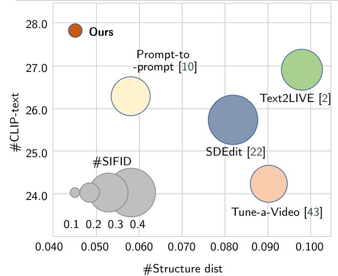

# Exploring training data-free video generation from a single image via a stable diffusion model


We proposed method can generate various types of videos, as has been thoroughly validated in the experimental and supplementary material sections. However, it is important to note that this method primarily relies on image- and text-guided video generation. When generating videos with subtle movements, the method requires minimal computational time and resources. However, for videos with large movements or complex scenes, multiple samplings are necessary. To achieve smoother and more fluid videos, especially in complex scenes, multiple scene divisions and frame insertions are required, and the text descriptions need to be dynamically adjusted manually, which increases the interactive workload to some extent. In future work, we will focus on improving the frame interpolation techniques for complex-motion videos to reduce the number of required interpolations and achieve smoother video generation.

**TL;DR**: no finetuning required, no video input needed, input structure preserved.

## Results
All our results are based on stable-diffusion-v1-4 model. Please the website for more results.

The top row for each of the results below show generating of real images, and the bottom row shows synthetic image generating.
## Real Image generating


## synthetic image generating

## Method Details
Given an input image, we first generate text captions using BLIP and apply regularized DDIM inversion to obtain our inverted noise map. Then, we obtain reference cross-attention maps that correspoind to the structure of the input image by denoising, guided with the CLIP embeddings of our generated text (c). Next, we denoise with edited text embeddings, while enforcing a loss to match current cross-attention maps with the reference cross-attention maps.

## Getting Started
**Environment Setup**
We provide a conda env file that contains all the required dependencies
```javascript
conda env create -f environment.yml
```
**Real Image generation**
We can perform image generating  as shown below. The command below will save the generated video as output/test_real/generate/test_1.png
```javascript
python src/generate_real.py \
    --input "input/test_image"
    --prompt "The autumn scenery has arrived." \
    --results_folder "output/test_generate/" 
```
**Real Image generation**
Similarly,we can generate the synthetic images generated by Stable Diffusion with the following command.
```javascript
python src/generate_real.py \
    --input "The spring scenery by the riverside."
    --prompt "The autumn scenery has arrived." \
    --results_folder "output/test_generate/" 
```
**Comparison**
Comparisons with different baselines, including, Text2Live, Tune-a-video, and pix2video. Our method successfully applies the generation, while preserving the structure of the input image.
